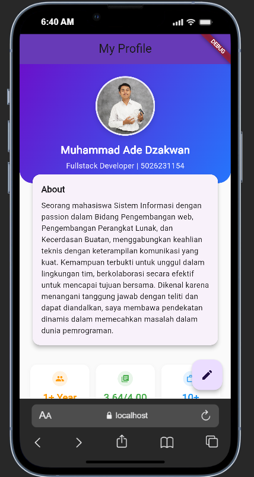

# My Profile App

## 📱 Tentang Aplikasi

My Profile App adalah aplikasi mobile berbasis Flutter yang menampilkan informasi profil pribadi dengan tampilan yang modern dan responsif. Aplikasi ini dirancang untuk memudahkan pengguna dalam mempresentasikan identitas, keahlian, dan informasi kontak mereka dalam satu platform yang menarik.

## ✨ Fitur Aplikasi

### 1. **Profil Pribadi**
- Menampilkan foto profil
- Nama lengkap dan title/jabatan
- Bio atau deskripsi singkat
- Informasi kontak (email, nomor telepon)

### 2. **Informasi Detail**
- Tanggal lahir dan umur
- Lokasi/alamat
- Website atau portfolio link
- Status (mahasiswa/pekerja/freelancer)

### 3. **Skills & Keahlian**
- Daftar kemampuan teknis
- Level keahlian untuk setiap skill
- Kategori skills (programming, design, dll)

### 4. **Pengalaman**
- Riwayat pekerjaan
- Riwayat pendidikan
- Sertifikasi atau penghargaan

### 5. **Portfolio/Project**
- Showcase project yang pernah dikerjakan
- Link ke repository GitHub
- Gambar atau screenshot project

### 6. **Media Sosial**
- Link ke profil LinkedIn
- Link ke GitHub
- Instagram, Twitter, dll
- Tombol untuk membuka link eksternal

### 7. **Kontak Langsung**
- Tombol call langsung
- Tombol email langsung
- Tombol WhatsApp/Telegram
- Share profil ke aplikasi lain

## 📸 Screenshot Aplikasi

### Tampilan Utama

*Halaman utama dengan foto profil, nama, dan bio*

> **Catatan**: Simpan screenshot aplikasi Anda di folder `screenshots/` di root project

## 🎨 Desain & UI/UX

### Karakteristik Desain:
- **Modern & Minimalis** - UI yang clean dan tidak berantakan
- **Responsive** - Menyesuaikan dengan berbagai ukuran layar
- **Intuitive** - Navigasi yang mudah dipahami
- **Smooth Animation** - Transisi halaman yang smooth
- **Dark Mode Support** - Pilihan tema terang dan gelap

### Komponen UI:
- Card untuk menampilkan informasi
- Avatar/CircleAvatar untuk foto profil
- ListTile untuk daftar informasi
- Chip untuk menampilkan skills
- FloatingActionButton untuk aksi cepat
- BottomNavigationBar untuk navigasi utama

## 🔧 Teknologi & Dependencies

### Core Technology:
- **Flutter** - Framework UI
- **Dart** - Bahasa pemrograman

### Dependencies yang Mungkin Digunakan:
```yaml
dependencies:
  flutter:
    sdk: flutter
  
  # UI Components
  cupertino_icons: ^1.0.2
  google_fonts: ^6.1.0
  
  # State Management
  provider: ^6.1.0
  
  # URL Launcher (untuk link eksternal)
  url_launcher: ^6.2.2
  
  # Icons tambahan
  font_awesome_flutter: ^10.6.0
  
  # Animasi
  animations: ^2.0.11
  
  # Image
  cached_network_image: ^3.3.0
```

## 🚀 Cara Instalasi

### 1. Clone Repository
```bash
git clone https://github.com/nawa316/my-profile-app.git
cd my-profile-app
```

### 2. Install Dependencies
```bash
flutter pub get
```

### 3. Jalankan Aplikasi
```bash
flutter run
```

### 4. Build untuk Release
```bash
# Android
flutter build apk --release

# iOS
flutter build ios --release
```

## 📁 Struktur Folder

```
my-profile-app/
├── lib/
│   ├── main.dart                 # Entry point
│   ├── screens/
│   │   ├── home_screen.dart      # Halaman utama
│   │   ├── profile_screen.dart   # Halaman detail profil
│   │   ├── skills_screen.dart    # Halaman skills
│   │   ├── portfolio_screen.dart # Halaman portfolio
│   │   └── contact_screen.dart   # Halaman kontak
│   ├── widgets/
│   │   ├── profile_header.dart   # Widget header profil
│   │   ├── skill_card.dart       # Widget card skill
│   │   ├── project_card.dart     # Widget card project
│   │   └── social_button.dart    # Widget tombol sosmed
│   ├── models/
│   │   ├── user_model.dart       # Model data user
│   │   ├── skill_model.dart      # Model data skill
│   │   └── project_model.dart    # Model data project
│   └── constants/
│       ├── colors.dart           # Konstanta warna
│       └── strings.dart          # Konstanta teks
├── assets/
│   ├── images/
│   │   └── profile_photo.jpg     # Foto profil
│   └── icons/
├── screenshots/                   # Screenshot aplikasi
└── pubspec.yaml
```

## 💡 Cara Kustomisasi

### 1. Mengubah Informasi Profil

Edit file `lib/models/user_model.dart` atau data profil di `main.dart`:

```dart
final userProfile = UserModel(
  name: "Nama Anda",
  title: "Flutter Developer",
  email: "email@example.com",
  phone: "+62812345678",
  bio: "Deskripsi singkat tentang Anda",
  location: "Jakarta, Indonesia",
  // ... data lainnya
);
```

### 2. Menambahkan Skills

Tambahkan skills baru di list skills:

```dart
final skills = [
  Skill(name: "Flutter", level: 0.9),
  Skill(name: "Dart", level: 0.85),
  Skill(name: "Firebase", level: 0.75),
  // Tambahkan skill lainnya
];
```

### 3. Mengganti Foto Profil

1. Letakkan foto di `assets/images/profile_photo.jpg`
2. Pastikan sudah terdaftar di `pubspec.yaml`
3. Gunakan di code: `Image.asset('assets/images/profile_photo.jpg')`

### 4. Mengubah Warna Tema

Edit file `lib/constants/colors.dart`:

```dart
const primaryColor = Color(0xFF2196F3);
const accentColor = Color(0xFF00BCD4);
const backgroundColor = Color(0xFFF5F5F5);
```

## 🎯 Use Case

Aplikasi ini cocok untuk:
- **Fresh Graduate** - Showcase portfolio saat melamar kerja
- **Freelancer** - Digital business card
- **Developer** - Menampilkan skills dan project
- **Mahasiswa** - Profil akademik dan organisasi
- **Professional** - Digital CV interaktif

## 🔜 Pengembangan Selanjutnya

Fitur yang bisa ditambahkan:
- [ ] Edit profil langsung dari aplikasi
- [ ] Integrasi dengan Firebase untuk sync data
- [ ] Export CV ke PDF
- [ ] Multi-bahasa (Indonesia & English)
- [ ] Achievement/Badge system
- [ ] Blog atau artikel section
- [ ] Statistik profil viewer
- [ ] QR Code untuk share profil

## 👨‍💻 Developer

**nawa316**
- GitHub: [@nawa316](https://github.com/nawa316)
- Repository: [my-profile-app](https://github.com/nawa316/my-profile-app)

## 📄 Lisensi

Proyek ini bersifat open source dan bebas digunakan untuk keperluan personal maupun komersial.

---

**Dibuat dengan** ❤️ **menggunakan Flutter**